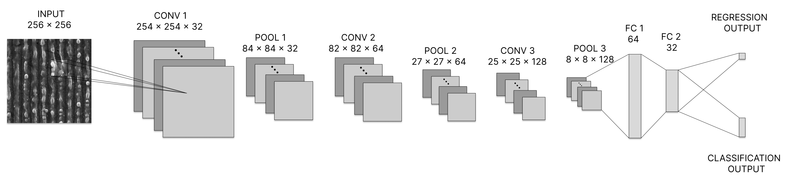
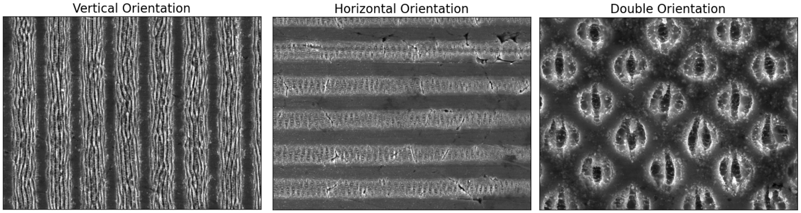

# Laser-CNN

<div align="center">
  
</div>

## Ultrafast Laser Parameter Inference

This project, which has the code from the paper"Inferring the Parameters of Ultrafast Lasers from Images with Surface Patterns," employs machine learning techniques for inferring parameters of ultrafast lasers from images of laser-induced surface patterns. Notably, this project provides access to the DLIP (Direct Laser Interference Patterning) data used in the study, allowing for a practical application and exploration of the research findings.

The DLIP technology, crucial in this research, utilizes the interference of laser pulses to engineer periodic nanostructures. This intricate process can be modeled using the spatial intensity distributions generated by the interference of laser beams, which determine the orientation of surface patterns. Our dataset comprises images of stainless steel surfaces processed with DLIP, annotated with respective laser parameters.

<div align="center">
  
</div>

## Instructions
These instructions will help you set up the project on your local machine for development and testing purposes.

### Prerequisites

- Anaconda or Miniconda (Python 3.x)

### Installation

1. **Clone or download the Repository**
2. **Create and Activate Conda Environment**
   Using the provided environment.yml file:
   ```bash
   conda env create -f environment.yml
   ```
3. **Dataset Preparation:** Run the `create_dataset.py` script to prepare the dataset
4. **Uniform Cross-Validation Splits:** To generate 5-fold cross-validation datasets, run:
   ```bash
   python uniform_cross_validation_splits.py
   ```
### Usage

You can train separate models for classification and regression tasks.

For the classifier: 
```bash
   python classifier_train.py -b [BATCH_SIZE] -e [EPOCHS] -lr [LEARNING_RATE] -d [DROPOUT_STRENGTH] -l [LABEL] --loss_function [LOSS_FUNCTION] --activation_function [ACTIVATION_FUNCTION] -c [CROSS_VAL]
```
   
For the regressor: 
```bash
   python regressor_train.py -b [BATCH_SIZE] -e [EPOCHS] -lr [LEARNING_RATE] -d [DROPOUT_STRENGTH] -l [LABEL] --loss_function [LOSS_FUNCTION] --activation_function [ACTIVATION_FUNCTION] -c [CROSS_VAL]
```
Replace the bracketed terms with appropriate values as per your requirements.

## Citation

For academic use, please cite the original paper: 
```bibtex
@inproceedings{litsas2023inferring,
  title={Inferring the Parameters of Ultrafast Lasers from Images with Surface Patterns},
  author={Litsas, Anastasis and Fraggelakis, Fotis and Tsibidis, George D and Stratakis, Emmanuel and Pantazis, Yannis},
  booktitle={2023 International Symposium on Image and Signal Processing and Analysis (ISPA)},
  pages={1--6},
  year={2023},
  organization={IEEE}
}
```
